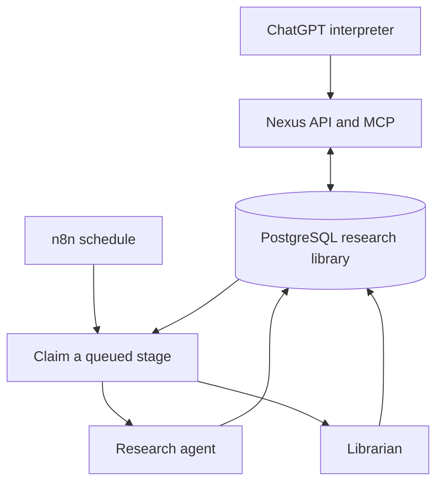

# Architecture

## Interpreter

`inspect_research` embeds the question and retrieves relevant notes and past jobs. PostgreSQL combines vector similarity with full-text matches. It returns evidence and an expiring inspection ID. ChatGPT evaluates completeness, age, uncertainty and active work; it can propose reuse, waiting or a focused continuation. The API does not claim a similarity match means a question is answered.

`start_research` requires a recent inspection and a gap/focus statement. It reserves a unique active fingerprint for the normalized question. Reusing the same inspection is idempotent. Completed identical questions are reused unless `refresh=true`. Different wording is compared semantically by the interpreter rather than being silently blocked.

## Durable execution

n8n polls the claim endpoint every minute. Database compare-and-swap updates ensure only one worker claims a queued stage. Every claim has a short-lived random lease; a second guarded update ensures that lease can execute the stage only once. Cancellation and lease expiry fence late results.

Each round has two independently persisted stages:

1. **Research:** retrieve existing notes and all notes from this job; ask the Responses API for a bounded web-search report; store the report, provider citation annotations, usage and response ID.
2. **Librarian:** structure the saved report; validate source URLs and existing note IDs; embed and store short notes with evidence links; identify remaining gaps or a stopping reason.

The librarian serializes shared catalog writes across jobs using a PostgreSQL advisory transaction lock. Job updates, evidence additions and round completion commit together. It never holds a database lock while waiting on a model request. SQLite uses a short immediate write transaction for the corresponding local-development step.

There is no distributed exactly-once guarantee for external provider charges. The app disables automatic SDK and n8n retries to reduce repeated charges after uncertain failures. PostgreSQL guarantees local atomic state changes. Operators explicitly retry failed stages.

## Compounding and provenance

- `inspections`: question, semantic vector and preflight timestamp.
- `jobs`: original question, changing research focus, round allowance, stage, status and lease.
- `research_rounds`: immutable research report, citations, provider response ID, timestamp, research usage and librarian result.
- `sources`: canonical URL and first observed title/time.
- `notes`: small claims, confidence, kind and semantic vectors.
- `evidence`: links each claim to a source and the round in which it was observed.
- `contradictions`: links conflicting claims without deleting either.
- `auth_records`: hashed, expiring OAuth codes, tokens and login tickets.

URL normalization removes tracking fields and fragments while preserving meaningful query parameters and path case. A repeated note/source observation is retained in history but does not count as new evidence. Reusing an existing note adds support; material changes should produce a separate note. Confidence is a model judgment, not a calibrated probability.

## Library questions

`answer_from_library` retrieves notes plus linked contradictions. The answer model receives no tools and is instructed to use only that context. Every answer part must reference a retrieved note ID; the API rejects unknown IDs and returns the linked sources. An empty retrieval returns an explicit gap without calling the answer model.

Source membership and note IDs are enforced in code. Semantic support/entailment and model abstention with partial evidence are not formally guaranteed. The first version needs human spot checks for important conclusions. Retrieval can miss relevant material; “no relevant saved research” is not proof that a fact is false.

## Access and scope

One deployment equals one owner's library. Public ChatGPT traffic uses OAuth; the REST operator interface uses a different bearer token; n8n uses a worker-only token. The public reverse proxy blocks all worker endpoints. The n8n editor is accessed through SSH. No tools accept arbitrary callback URLs, shell commands, file paths or delivery recipients.

Research content is treated as untrusted text in prompts. The model cannot directly mutate SQL, create tasks or alter authentication. Only the validated librarian schema can add notes; stop budgets and state transitions remain application code.

## Model integration references

- [Responses web search and citation annotations](https://developers.openai.com/api/docs/guides/tools-web-search)
- [GPT-5 mini capabilities](https://developers.openai.com/api/docs/models/gpt-5-mini)
- [MCP authentication contract](https://developers.openai.com/plugins/build/auth)

Models are configurable. This initial implementation uses OpenAI for research, embeddings, librarian extraction and answer synthesis; it does not include a provider-neutral adapter configuration or local-model fallback.
